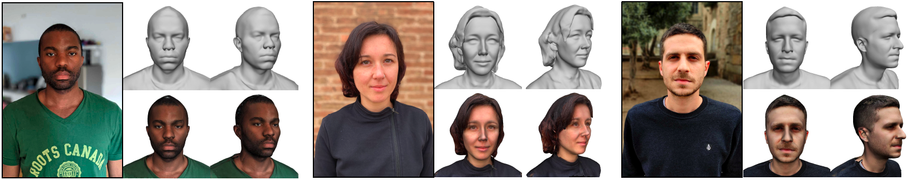
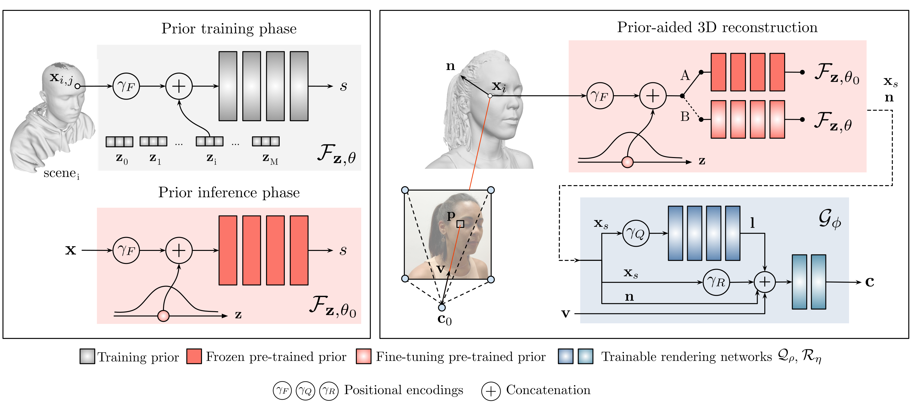
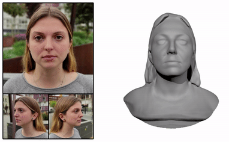
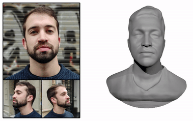

## Abstract

Recent learning approaches that implicitly represent surface geometry using coordinate-based neural representations have shown impressive results in the problem of multi-view 3D reconstruction. The effectiveness of these techniques is, however, subject to the availability of a large number (several tens) of input views of the scene, and computationally demanding optimizations. In this paper, we tackle these limitations for the specific problem of few-shot full 3D head reconstruction, by endowing coordinate-based representations with a probabilistic shape prior that enables faster convergence and better generalization when using few input images (down to three). First, we learn a shape model of 3D heads from thousands of incomplete raw scans using implicit representations. At test time, we jointly overfit two coordinate-based neural networks to the scene, one modeling the geometry and another estimating the surface radiance, using implicit differentiable rendering. We devise a two-stage optimization strategy in which the learned prior is used to initialize and constrain the geometry during an initial optimization phase. Then, the prior is unfrozen and fine-tuned to the scene. By doing this, we achieve high-fidelity head reconstructions, including hair and shoulders, and with a high level of detail that consistently outperforms both state-of-the-art 3D Morphable Models methods in the few-shot scenario, and non-parametric methods when large sets of views are available.

## Method

H3D-Net is a neural architecture that reconstructs high-quality 3D human heads from a few input images with associated masks and camera poses. At training time, a [DeepSDF](https://arxiv.org/abs/1901.05103)-like model (red) is trained to capture the distribution of human heads from raw 3D data using a Signed Distance Function (SDF) as representation. At test time, this model is connected with a coordinate-based rendering network (blue), similarly to [IDR](https://arxiv.org/abs/2003.09852), that estimates the emited radiance for each 3D surface point, enabling direct supervision in the image domain. During the 3D reconstruction process, the prior model keeps the estimated surface within the space of plausible solutions and it is eventually unfrozen to capture fine details.



## Results

The proposed method performs well in both few-shot and many-shot scenarios, outperforming model-based methods like [MVFNet](https://openaccess.thecvf.com/content_CVPR_2019/papers/Wu_MVF-Net_Multi-View_3D_Face_Morphable_Model_Regression_CVPR_2019_paper.pdf) and [DFNRMVS](https://openaccess.thecvf.com/content_CVPR_2020/papers/Bai_Deep_Facial_Non-Rigid_Multi-View_Stereo_CVPR_2020_paper.pdf) in 3D face reconstruction from only 3 views, and model-free approaches like [IDR](https://arxiv.org/abs/2003.09852) in full head reconstruction.

Next, we show full head 3D reconstructions from only 3 input images. In these examples, the camera poses have been regressed using a pre-trained [MRL model](https://openaccess.thecvf.com/content_ICCVW_2019/papers/GMDL/Ramon_Hyperparameter-Free_Losses_for_Model-Based_Monocular_Reconstruction_ICCVW_2019_paper.pdf), which minimizes the reprojection error. The masks have been estimated using [U2Net](https://arxiv.org/pdf/2005.09007.pdf) and then have been manually refined.

<p align="center">
  
  
</p>

We also provide a qualitative and quantitative comparison with respect to [IDR](https://arxiv.org/abs/2003.09852) varying the number of available views. Note how H3D-Net effectively finds realistic and detailed solutions in both few-shot and many-shot scenarios.

<p align="center">
  
</p>

## Related work

1. [DeepSDF: Learning Continuous Signed Distance Functions for Shape Representation (2019)](https://arxiv.org/abs/1901.05103)
2. [Implicit Geometric Regularization for Learning Shapes (2020)](https://arxiv.org/abs/2002.10099)
3. [Multiview Neural Surface Reconstruction with Implicit Lighting and Material (2020)](https://arxiv.org/abs/2003.09852)

## BibTeX

```
@inproceedings{ramon2021h3d,
  title={H3D-Net: Few-Shot High-Fidelity 3D Head Reconstruction},
  author={Ramon, Eduard and Triginer, Gil and Escur, Janna and Pumarola, Albert and Garcia, Jaime and Giro-i-Nieto, Xavier and Moreno-Noguer, Francesc},
  journal={arXiv preprint arXiv:2107.12512},
  booktitle={Proceedings of the IEEE/CVF International Conference on Computer Vision},
  pages={5620--5629},
  year={2021}
}
```
